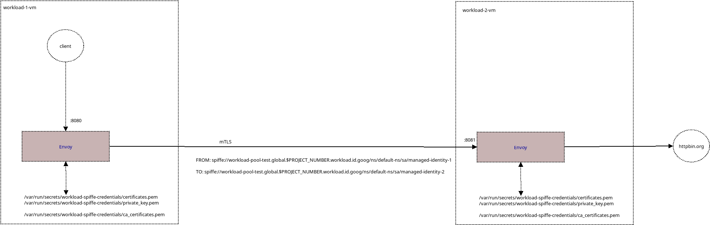

### Configure GCP Compute Workload mTLS with Envoy

Simple demo of [Authenticate workloads to other workloads over mTLS](https://cloud.google.com/compute/docs/access/authenticate-workloads-over-mtls) using Envoy.

What this demo will do is setup two workoads and envoy such that `envoy<->envoy` peers use the mtls certificates provided by the GCE service stated above.  Your are ofcourse free to terminate TLS on any application you choose



The configuration on envoy is intentionally left very restrictive such that workload2 will ONLY accept connections from workload-1's certificate and workload-1 will match the server certificate provided by workoad-2.

>> NOTE: this feature is preview right now (12/17/24) and subject to change; if you want to try this out, contact your account team.

### Setup

```bash
export PROJECT_ID=`gcloud config get-value core/project`
export BILLING_PROJECT_ID=`gcloud config get-value core/project`
export PROJECT_NUMBER=`gcloud projects describe $PROJECT_ID --format='value(projectNumber)'`

export POOL_ID=workload-pool-test
export SUBORDINATE_CA_POOL_REGION=us-central1
export NAMESPACE_ID=default-ns
export MANAGED_IDENTITY_ID=managed-identity-1
export MANAGED_IDENTITY_ID_2=managed-identity-2
export ROOT_POOL=r-pool-1
export ROOT_CA=r-1
export SUBORDINATE_CA_POOL_ID=s-pool-1
export SUB_CA=s-1

envsubst < "envoy_workload_1_tmpl.yaml" > "envoy_workload_1.yaml"
envsubst < "envoy_workload_2_tmpl.yaml" > "envoy_workload_2.yaml"
envsubst < "config_tmpl.json" > "config.json"
envsubst < "config2_tmpl.json" > "config2.json"
envsubst < "attestation_tmpl.json" > "attestation.json"
envsubst < "attestation2_tmpl.json" > "attestation2.json"


gcloud iam service-accounts create workload-1-sa
gcloud iam service-accounts create workload-2-sa

$ gcloud iam workload-identity-pools create $POOL_ID --location="global"  --mode="TRUST_DOMAIN" --project=$PROJECT_ID --billing-project=$BILLING_PROJECT_ID

gcloud iam workload-identity-pools namespaces get $NAMESPACE_ID \
    --workload-identity-pool=$POOL_ID \
    --location="global"  --project=$PROJECT_ID --billing-project=$BILLING_PROJECT_ID

gcloud iam workload-identity-pools managed-identities create managed-identity-1 \
    --namespace=$NAMESPACE_ID \
    --workload-identity-pool=$POOL_ID \
    --location="global"  --project=$PROJECT_ID --billing-project=$BILLING_PROJECT_ID

gcloud privateca pools create $ROOT_POOL \
   --location=us-central1 \
   --tier=enterprise

gcloud privateca roots create $ROOT_CA \
   --pool=$ROOT_POOL \
   --subject "CN=ROOT_CA_CN, O=ROOT_CA_ORGANIZATION" \
   --key-algorithm="ec-p256-sha256" \
   --max-chain-length=1 \
   --location=us-central1

gcloud privateca pools create $SUBORDINATE_CA_POOL_ID \
   --location=us-central1 \
   --tier=devops

gcloud privateca subordinates create $SUB_CA \
   --pool=$SUBORDINATE_CA_POOL_ID \
   --location=us-central1 \
   --issuer-pool=$ROOT_POOL \
   --issuer-location=us-central1 \
   --subject="CN=SUBORDINATE_CA_CN_ENTERPRISE, O=SUBORDINATE_CA_ORGANIZATION" \
   --key-algorithm="ec-p256-sha256" \
   --use-preset-profile=subordinate_mtls_pathlen_0


gcloud iam workload-identity-pools managed-identities set-attestation-rules $MANAGED_IDENTITY_ID \
   --namespace=$NAMESPACE_ID \
   --workload-identity-pool=$POOL_ID \
   --policy-file=attestation.json \
   --location=global --project=$PROJECT_ID --billing-project=$BILLING_PROJECT_ID


gcloud iam workload-identity-pools managed-identities set-attestation-rules $MANAGED_IDENTITY_ID_2 \
   --namespace=$NAMESPACE_ID \
   --workload-identity-pool=$POOL_ID \
   --policy-file=attestation2.json \
   --location=global --project=$PROJECT_ID --billing-project=$BILLING_PROJECT_ID


gcloud privateca pools add-iam-policy-binding $SUBORDINATE_CA_POOL_ID   --role=roles/privateca.workloadCertificateRequester  --member="principalSet://iam.googleapis.com/projects/$PROJECT_NUMBER/locations/global/workloadIdentityPools/$POOL_ID/*" --location=us-central1

gcloud privateca pools add-iam-policy-binding $SUBORDINATE_CA_POOL_ID    --role=roles/privateca.poolReader  --member="principalSet://iam.googleapis.com/projects/$PROJECT_NUMBER/locations/global/workloadIdentityPools/$POOL_ID/*" --location=us-central1
```

now create two VMs:

```bash

gcloud beta compute instances create workload-1-vm \
   --zone=us-central1-a \
   --service-account workload-1-sa@$PROJECT_ID.iam.gserviceaccount.com \
   --metadata enable-workload-certificate=true \
   --partner-metadata-from-file=config.json 

gcloud beta compute instances create workload-2-vm \
   --zone=us-central1-a \
   --service-account workload-2-sa@$PROJECT_ID.iam.gserviceaccount.com \
   --metadata enable-workload-certificate=true \
   --partner-metadata-from-file=config2.json 
```


Confirm mtls certificates are setup:

via serial:

```bash
gcloud compute instances get-serial-port-output workload-1-vm

Dec  5 11:58:41 workload-1-vm systemd[1]: Starting GCE Workload Certificate refresh...
Dec  5 11:58:41 workload-1-vm gce_workload_cert_refresh[929]: 2024/12/05 11:58:41: Creating timestamp contents dir /run/secrets/workload-spiffe-contents-2024-12-05T11:58:41Z
Dec  5 11:58:41 workload-1-vm gce_workload_cert_refresh[929]: 2024/12/05 11:58:41: Rotating symlink /run/secrets/workload-spiffe-credentials
Dec  5 11:58:41 workload-1-vm gce_workload_cert_refresh[929]: 2024/12/05 11:58:41: Removing old content dir /run/secrets/workload-spiffe-contents-2024-12-05T11:48:18Z
Dec  5 11:58:41 workload-1-vm gce_workload_cert_refresh[929]: 2024/12/05 11:58:41: Done
Dec  5 11:58:41 workload-1-vm systemd[1]: gce-workload-cert-refresh.service: Succeeded.
```

To view the actual certs:

```bash
gcloud compute ssh workload-1-vm --zone=us-central1-a --tunnel-through-iap

### note certificates.pem contains both the issuer and leaf, only the leaf is rendered by the command below
$ openssl x509 -in /var/run/secrets/workload-spiffe-credentials/certificates.pem -noout -text

 Certificate:
    Data:
        Version: 3 (0x2)
        Serial Number:
            42:8a:d5:c6:6c:0e:5b:97:b3:4f:50:4a:06:8f:08:1b:59:ec:25
        Signature Algorithm: ecdsa-with-SHA256
        Issuer: O = SUBORDINATE_CA_ORGANIZATION, CN = SUBORDINATE_CA_CN
        Validity
            Not Before: Dec  2 17:54:31 2024 GMT
            Not After : Dec  3 17:54:30 2024 GMT
        Subject: 
        Subject Public Key Info:
            Public Key Algorithm: id-ecPublicKey
                Public-Key: (256 bit)
                pub:
                    04:de:89:05:19:29:97:9f:09:a7:48:a4:f9:b4:70:
                    3d:67:2b:20:b0:4b:21:46:36:2d:d2:07:7b:02:18:
                    ac:4c:be:58:a7:1c:12:ef:10:50:20:fd:c7:99:14:
                    a6:ae:a7:9d:e5:73:ee:d9:28:b4:1b:09:1b:49:b1:
                    1c:9b:07:29:47
                ASN1 OID: prime256v1
                NIST CURVE: P-256
        X509v3 extensions:
            X509v3 Key Usage: critical
                Digital Signature, Key Agreement
            X509v3 Extended Key Usage: 
                TLS Web Server Authentication, TLS Web Client Authentication
            X509v3 Basic Constraints: critical
                CA:FALSE
            X509v3 Subject Key Identifier: 
                F3:05:A8:D8:18:3A:D0:6E:3B:69:3E:94:F6:4D:64:01:B4:58:62:71
            X509v3 Authority Key Identifier: 
                keyid:12:8A:4A:2C:EB:D2:32:CF:3D:96:79:75:1E:91:D8:AF:3D:6C:B8:5E

            Authority Information Access: 
                CA Issuers - URI:http://privateca-content-67437f64-0000-2e75-9dd0-30fd3814537c.storage.googleapis.com/5c5460b17a1ef6277a86/ca.crt

            X509v3 Subject Alternative Name: critical
                URI:spiffe://workload-pool-test.global.708288290784.workload.id.goog/ns/default-ns/sa/managed-identity-1
```

### Test

First [install Envoy](https://www.envoyproxy.io/docs/envoy/latest/start/install) on both `workload-1-vm` and `workload-2-vm`


Copy `envoy_workload_1.yaml` and `envoy_workload_2.yaml` to their respective systems, then on each respectively run


```bash
envoy -c envoy_workload_1.yaml -l trace
```

```bash
envoy -c envoy_workload_2.yaml -l trace
```

Then run client on `workload-1-vm`

```bash
 curl -v -H "host:  workload-2-vm.c.$PROJECT_ID.internal:8080"  \
    --resolve  workload-2-vm.c.$PROJECT_ID.internal:8080:127.0.0.1  \
      --connect-to  workload-2-vm.c.$PROJECT_ID.internal:8080:127.0.0.1:8080  http://workload-2-vm.c.$PROJECT_ID.internal:8080/get
```

If you want to see the full logs:


```bash
 curl -v -H "host:  workload-2-vm.c.$PROJECT_ID.internal:8080"  \
    --resolve  workload-2-vm.c.$PROJECT_ID.internal:8080:127.0.0.1  \
      --connect-to  workload-2-vm.c.$PROJECT_ID.internal:8080:127.0.0.1:8080  http://workload-2-vm.c.$PROJECT_ID.internal:8080/get

> GET /get HTTP/1.1
> Host:  workload-2-vm.c.srashid-test2.internal:8080
> User-Agent: curl/7.74.0
> Accept: */*
> 
* Mark bundle as not supporting multiuse
< HTTP/1.1 200 OK
< date: Mon, 09 Dec 2024 11:23:20 GMT
< content-type: application/json
< content-length: 460
< server: envoy
< access-control-allow-origin: *
< access-control-allow-credentials: true
< x-envoy-upstream-service-time: 1273
< 
{
  "args": {}, 
  "headers": {
    "Accept": "*/*", 
    "Downstream-Peer-Fingerprint": "f8a687b17055d80d6b0945c55543496d32567e219a4c822f7a062e5337629c93", 
    "Host": "workload-2-vm.c.srashid-test2.internal", 
    "User-Agent": "curl/7.74.0", 
    "X-Amzn-Trace-Id": "Root=1-6756d327-23a459745c5693242670364e", 
    "X-Envoy-Expected-Rq-Timeout-Ms": "15000"
  }, 
  "origin": "34.46.86.156", 
  "url": "https://workload-2-vm.c.srashid-test2.internal/get"
}
```

- `workload-1`:

```log
[2024-12-09 11:23:19.591][11970][trace][filter] [source/extensions/filters/listener/tls_inspector/tls_inspector.cc:106] tls inspector: new connection accepted
[2024-12-09 11:23:19.591][11970][trace][misc] [source/common/network/tcp_listener_impl.cc:114] TcpListener accepted 1 new connections.
[2024-12-09 11:23:19.591][11970][trace][filter] [source/common/network/listener_filter_buffer_impl.cc:95] onFileEvent: 1
[2024-12-09 11:23:19.591][11970][trace][filter] [source/common/network/listener_filter_buffer_impl.cc:60] recv returned: 0
[2024-12-09 11:23:19.591][11970][trace][filter] [source/common/network/listener_filter_buffer_impl.cc:64] recv return try again
[2024-12-09 11:23:19.591][11970][trace][filter] [source/common/network/listener_filter_buffer_impl.cc:95] onFileEvent: 1
[2024-12-09 11:23:19.591][11970][trace][filter] [source/common/network/listener_filter_buffer_impl.cc:60] recv returned: 111
[2024-12-09 11:23:19.591][11970][trace][filter] [source/extensions/filters/listener/tls_inspector/tls_inspector.cc:146] tls inspector: recv: 111
[2024-12-09 11:23:19.591][11970][trace][filter] [source/extensions/filters/listener/http_inspector/http_inspector.cc:53] http inspector: new connection accepted
[2024-12-09 11:23:19.592][11970][trace][filter] [source/common/network/listener_filter_buffer_impl.cc:95] onFileEvent: 1
[2024-12-09 11:23:19.592][11970][trace][filter] [source/common/network/listener_filter_buffer_impl.cc:60] recv returned: 111
[2024-12-09 11:23:19.592][11970][trace][filter] [source/extensions/filters/listener/http_inspector/http_inspector.cc:92] http inspector: http_parser parsed 18 chars, error code: 0
[2024-12-09 11:23:19.592][11970][trace][filter] [source/extensions/filters/listener/http_inspector/http_inspector.cc:122] http inspector: done: true
[2024-12-09 11:23:19.592][11970][debug][filter] [source/extensions/filters/listener/http_inspector/http_inspector.cc:139] http inspector: set application protocol to http/1.1
[2024-12-09 11:23:19.592][11970][trace][http] [source/common/http/conn_manager_impl.cc:136] LoadShedPoint envoy.load_shed_points.http_connection_manager_decode_headers is not found. Is it configured?
[2024-12-09 11:23:19.592][11970][trace][http] [source/common/http/conn_manager_impl.cc:139] LoadShedPoint envoy.load_shed_points.hcm_ondata_creating_codec is not found. Is it configured?
[2024-12-09 11:23:19.592][11970][trace][misc] [source/common/event/scaled_range_timer_manager_impl.cc:60] enableTimer called on 0x78b7f71dc80 for 3600000ms, min is 3600000ms
[2024-12-09 11:23:19.592][11970][trace][connection] [source/common/network/connection_impl.cc:469] [Tags: "ConnectionId":"0"] raising connection event 2
[2024-12-09 11:23:19.592][11970][debug][conn_handler] [source/common/listener_manager/active_tcp_listener.cc:160] [Tags: "ConnectionId":"0"] new connection from 127.0.0.1:36518
[2024-12-09 11:23:19.592][11970][trace][main] [source/common/event/dispatcher_impl.cc:233] item added to deferred deletion list (size=1)
[2024-12-09 11:23:19.592][11970][trace][main] [source/common/event/dispatcher_impl.cc:127] clearing deferred deletion list (size=1)
[2024-12-09 11:23:19.592][11970][trace][connection] [source/common/network/connection_impl.cc:614] [Tags: "ConnectionId":"0"] socket event: 3
[2024-12-09 11:23:19.592][11970][trace][connection] [source/common/network/connection_impl.cc:737] [Tags: "ConnectionId":"0"] write ready
[2024-12-09 11:23:19.592][11970][trace][connection] [source/common/network/connection_impl.cc:654] [Tags: "ConnectionId":"0"] read ready. dispatch_buffered_data=0
[2024-12-09 11:23:19.592][11970][trace][connection] [source/common/network/raw_buffer_socket.cc:25] [Tags: "ConnectionId":"0"] read returns: 111
[2024-12-09 11:23:19.592][11970][trace][connection] [source/common/network/raw_buffer_socket.cc:39] [Tags: "ConnectionId":"0"] read error: Resource temporarily unavailable, code: 0
[2024-12-09 11:23:19.592][11970][trace][http] [source/common/http/http1/codec_impl.cc:1077] LoadShedPoint envoy.load_shed_points.http1_server_abort_dispatch is not found. Is it configured?
[2024-12-09 11:23:19.592][11970][trace][http] [source/common/http/http1/codec_impl.cc:645] [Tags: "ConnectionId":"0"] parsing 111 bytes
[2024-12-09 11:23:19.592][11970][trace][http] [source/common/http/http1/codec_impl.cc:587] [Tags: "ConnectionId":"0"] message begin
[2024-12-09 11:23:19.592][11970][debug][http] [source/common/http/conn_manager_impl.cc:393] [Tags: "ConnectionId":"0"] new stream
[2024-12-09 11:23:19.592][11970][trace][http] [./source/common/http/filter_manager.h:1123] LoadShedPoint envoy.load_shed_points.http_downstream_filter_check is not found. Is it configured?
[2024-12-09 11:23:19.592][11970][trace][misc] [source/common/event/scaled_range_timer_manager_impl.cc:60] enableTimer called on 0x78b7f71cb00 for 300000ms, min is 300000ms
[2024-12-09 11:23:19.592][11970][trace][http] [source/common/http/http1/codec_impl.cc:544] [Tags: "ConnectionId":"0"] completed header: key=Host value=workload-2-vm.c.srashid-test2.internal:8080
[2024-12-09 11:23:19.592][11970][trace][http] [source/common/http/http1/codec_impl.cc:544] [Tags: "ConnectionId":"0"] completed header: key=User-Agent value=curl/7.74.0
[2024-12-09 11:23:19.592][11970][trace][http] [source/common/http/http1/codec_impl.cc:838] [Tags: "ConnectionId":"0"] onHeadersCompleteImpl
[2024-12-09 11:23:19.592][11970][trace][http] [source/common/http/http1/codec_impl.cc:544] [Tags: "ConnectionId":"0"] completed header: key=Accept value=*/*
[2024-12-09 11:23:19.592][11970][trace][http] [source/common/http/http1/codec_impl.cc:1191] [Tags: "ConnectionId":"0"] Server: onHeadersComplete size=3
[2024-12-09 11:23:19.592][11970][trace][http] [source/common/http/http1/codec_impl.cc:942] [Tags: "ConnectionId":"0"] message complete
[2024-12-09 11:23:19.592][11970][debug][http] [source/common/http/conn_manager_impl.cc:1183] [Tags: "ConnectionId":"0","StreamId":"12723980872226558377"] request headers complete (end_stream=true):
':authority', 'workload-2-vm.c.srashid-test2.internal:8080'
':path', '/get'
':method', 'GET'
'user-agent', 'curl/7.74.0'
'accept', '*/*'

[2024-12-09 11:23:19.592][11970][debug][http] [source/common/http/conn_manager_impl.cc:1166] [Tags: "ConnectionId":"0","StreamId":"12723980872226558377"] request end stream timestamp recorded
[2024-12-09 11:23:19.592][11970][debug][connection] [./source/common/network/connection_impl.h:98] [Tags: "ConnectionId":"0"] current connecting state: false
[2024-12-09 11:23:19.592][11970][debug][router] [source/common/router/router.cc:527] [Tags: "ConnectionId":"0","StreamId":"12723980872226558377"] cluster 'service_workload_2' match for URL '/get'
[2024-12-09 11:23:19.592][11970][debug][router] [source/common/router/router.cc:756] [Tags: "ConnectionId":"0","StreamId":"12723980872226558377"] router decoding headers:
':authority', 'workload-2-vm.c.srashid-test2.internal:8080'
':path', '/get'
':method', 'GET'
':scheme', 'http'
'user-agent', 'curl/7.74.0'
'accept', '*/*'
'x-forwarded-proto', 'http'
'x-request-id', '4512d319-7fb8-49a9-a314-eb5769e3c674'
'x-envoy-expected-rq-timeout-ms', '15000'

[2024-12-09 11:23:19.592][11970][debug][pool] [source/common/http/conn_pool_base.cc:78] queueing stream due to no available connections (ready=0 busy=0 connecting=0)
[2024-12-09 11:23:19.592][11970][debug][pool] [source/common/conn_pool/conn_pool_base.cc:291] trying to create new connection
[2024-12-09 11:23:19.592][11970][trace][pool] [source/common/conn_pool/conn_pool_base.cc:292] ConnPoolImplBase 0x78b7f864800, ready_clients_.size(): 0, busy_clients_.size(): 0, connecting_clients_.size(): 0, connecting_stream_capacity_: 0, num_active_streams_: 0, pending_streams_.size(): 1 per upstream preconnect ratio: 1
[2024-12-09 11:23:19.592][11970][debug][pool] [source/common/conn_pool/conn_pool_base.cc:145] creating a new connection (connecting=0)
[2024-12-09 11:23:19.592][11970][debug][connection] [./source/common/network/connection_impl.h:98] [Tags: "ConnectionId":"1"] current connecting state: true
[2024-12-09 11:23:19.592][11970][debug][client] [source/common/http/codec_client.cc:57] [Tags: "ConnectionId":"1"] connecting
[2024-12-09 11:23:19.592][11970][debug][connection] [source/common/network/connection_impl.cc:1017] [Tags: "ConnectionId":"1"] connecting to 10.128.0.27:8080
[2024-12-09 11:23:19.592][11970][debug][connection] [source/common/network/connection_impl.cc:1036] [Tags: "ConnectionId":"1"] connection in progress
[2024-12-09 11:23:19.592][11970][trace][pool] [source/common/conn_pool/conn_pool_base.cc:131] not creating a new connection, shouldCreateNewConnection returned false.
[2024-12-09 11:23:19.592][11970][trace][http] [source/common/http/filter_manager.cc:570] [Tags: "ConnectionId":"0","StreamId":"12723980872226558377"] decode headers called: filter=envoy.filters.http.upstream_codec status=4
[2024-12-09 11:23:19.592][11970][trace][http] [source/common/http/filter_manager.cc:570] [Tags: "ConnectionId":"0","StreamId":"12723980872226558377"] decode headers called: filter=envoy.filters.http.router status=1
[2024-12-09 11:23:19.592][11970][trace][misc] [source/common/event/scaled_range_timer_manager_impl.cc:60] enableTimer called on 0x78b7f71cb00 for 300000ms, min is 300000ms
[2024-12-09 11:23:19.592][11970][trace][http] [source/common/http/http1/codec_impl.cc:695] [Tags: "ConnectionId":"0"] parsed 111 bytes
[2024-12-09 11:23:19.593][11970][trace][connection] [source/common/network/connection_impl.cc:614] [Tags: "ConnectionId":"1"] socket event: 2
[2024-12-09 11:23:19.593][11970][trace][connection] [source/common/network/connection_impl.cc:737] [Tags: "ConnectionId":"1"] write ready
[2024-12-09 11:23:19.593][11970][debug][connection] [source/common/network/connection_impl.cc:746] [Tags: "ConnectionId":"1"] connected
[2024-12-09 11:23:19.593][11970][trace][connection] [source/common/tls/ssl_handshaker.cc:149] [Tags: "ConnectionId":"1"] ssl error occurred while read: WANT_READ
[2024-12-09 11:23:19.595][11970][trace][connection] [source/common/network/connection_impl.cc:614] [Tags: "ConnectionId":"1"] socket event: 3
[2024-12-09 11:23:19.595][11970][trace][connection] [source/common/network/connection_impl.cc:737] [Tags: "ConnectionId":"1"] write ready
[2024-12-09 11:23:19.596][11970][trace][connection] [source/common/tls/ssl_handshaker.cc:149] [Tags: "ConnectionId":"1"] ssl error occurred while read: WANT_READ
[2024-12-09 11:23:19.596][11970][trace][connection] [source/common/network/connection_impl.cc:654] [Tags: "ConnectionId":"1"] read ready. dispatch_buffered_data=0
[2024-12-09 11:23:19.596][11970][trace][connection] [source/common/tls/ssl_handshaker.cc:149] [Tags: "ConnectionId":"1"] ssl error occurred while read: WANT_READ
[2024-12-09 11:23:19.597][11970][trace][connection] [source/common/network/connection_impl.cc:614] [Tags: "ConnectionId":"1"] socket event: 3
[2024-12-09 11:23:19.597][11970][trace][connection] [source/common/network/connection_impl.cc:737] [Tags: "ConnectionId":"1"] write ready
[2024-12-09 11:23:19.597][11970][trace][connection] [source/common/network/connection_impl.cc:469] [Tags: "ConnectionId":"1"] raising connection event 2
[2024-12-09 11:23:19.597][11970][debug][client] [source/common/http/codec_client.cc:88] [Tags: "ConnectionId":"1"] connected
[2024-12-09 11:23:19.597][11970][debug][pool] [source/common/conn_pool/conn_pool_base.cc:328] [Tags: "ConnectionId":"1"] attaching to next stream
[2024-12-09 11:23:19.597][11970][debug][pool] [source/common/conn_pool/conn_pool_base.cc:182] [Tags: "ConnectionId":"1"] creating stream
[2024-12-09 11:23:19.597][11970][debug][router] [source/common/router/upstream_request.cc:593] [Tags: "ConnectionId":"0","StreamId":"12723980872226558377"] pool ready
[2024-12-09 11:23:19.598][11970][trace][router] [source/common/router/upstream_codec_filter.cc:61] [Tags: "ConnectionId":"0","StreamId":"12723980872226558377"] proxying headers
[2024-12-09 11:23:19.598][11970][trace][connection] [source/common/network/connection_impl.cc:529] [Tags: "ConnectionId":"1"] writing 226 bytes, end_stream false
[2024-12-09 11:23:19.598][11970][debug][client] [source/common/http/codec_client.cc:142] [Tags: "ConnectionId":"1"] encode complete
[2024-12-09 11:23:19.598][11970][trace][http] [source/common/http/filter_manager.cc:68] [Tags: "ConnectionId":"0","StreamId":"12723980872226558377"] continuing filter chain: filter=0x78b7f71ce80
[2024-12-09 11:23:19.598][11970][trace][connection] [source/common/network/connection_impl.cc:737] [Tags: "ConnectionId":"1"] write ready
[2024-12-09 11:23:19.598][11970][trace][connection] [source/common/tls/ssl_socket.cc:282] [Tags: "ConnectionId":"1"] ssl write returns: 226
[2024-12-09 11:23:19.598][11970][trace][connection] [source/common/network/connection_impl.cc:654] [Tags: "ConnectionId":"1"] read ready. dispatch_buffered_data=0
[2024-12-09 11:23:19.598][11970][trace][connection] [source/common/tls/ssl_socket.cc:92] [Tags: "ConnectionId":"1"] ssl read returns: -1
[2024-12-09 11:23:19.598][11970][trace][connection] [source/common/tls/ssl_socket.cc:132] [Tags: "ConnectionId":"1"] ssl error occurred while read: WANT_READ
[2024-12-09 11:23:19.598][11970][trace][connection] [source/common/tls/ssl_socket.cc:168] [Tags: "ConnectionId":"1"] ssl read 0 bytes
[2024-12-09 11:23:19.598][11970][trace][connection] [source/common/network/connection_impl.cc:614] [Tags: "ConnectionId":"1"] socket event: 2
[2024-12-09 11:23:19.598][11970][trace][connection] [source/common/network/connection_impl.cc:737] [Tags: "ConnectionId":"1"] write ready
[2024-12-09 11:23:20.864][11970][trace][connection] [source/common/network/connection_impl.cc:614] [Tags: "ConnectionId":"1"] socket event: 3
[2024-12-09 11:23:20.864][11970][trace][connection] [source/common/network/connection_impl.cc:737] [Tags: "ConnectionId":"1"] write ready
[2024-12-09 11:23:20.864][11970][trace][connection] [source/common/network/connection_impl.cc:654] [Tags: "ConnectionId":"1"] read ready. dispatch_buffered_data=0
[2024-12-09 11:23:20.864][11970][trace][connection] [source/common/tls/ssl_socket.cc:92] [Tags: "ConnectionId":"1"] ssl read returns: 693
[2024-12-09 11:23:20.864][11970][trace][connection] [source/common/tls/ssl_socket.cc:92] [Tags: "ConnectionId":"1"] ssl read returns: -1
[2024-12-09 11:23:20.864][11970][trace][connection] [source/common/tls/ssl_socket.cc:132] [Tags: "ConnectionId":"1"] ssl error occurred while read: WANT_READ
[2024-12-09 11:23:20.864][11970][trace][connection] [source/common/tls/ssl_socket.cc:168] [Tags: "ConnectionId":"1"] ssl read 693 bytes
[2024-12-09 11:23:20.864][11970][trace][http] [source/common/http/http1/codec_impl.cc:645] [Tags: "ConnectionId":"1"] parsing 693 bytes
[2024-12-09 11:23:20.864][11970][trace][http] [source/common/http/http1/codec_impl.cc:587] [Tags: "ConnectionId":"1"] message begin
[2024-12-09 11:23:20.864][11970][trace][http] [source/common/http/http1/codec_impl.cc:544] [Tags: "ConnectionId":"1"] completed header: key=date value=Mon, 09 Dec 2024 11:23:20 GMT
[2024-12-09 11:23:20.864][11970][trace][http] [source/common/http/http1/codec_impl.cc:544] [Tags: "ConnectionId":"1"] completed header: key=content-type value=application/json
[2024-12-09 11:23:20.864][11970][trace][http] [source/common/http/http1/codec_impl.cc:544] [Tags: "ConnectionId":"1"] completed header: key=content-length value=460
[2024-12-09 11:23:20.865][11970][trace][http] [source/common/http/http1/codec_impl.cc:544] [Tags: "ConnectionId":"1"] completed header: key=server value=envoy
[2024-12-09 11:23:20.865][11970][trace][http] [source/common/http/http1/codec_impl.cc:544] [Tags: "ConnectionId":"1"] completed header: key=access-control-allow-origin value=*
[2024-12-09 11:23:20.865][11970][trace][http] [source/common/http/http1/codec_impl.cc:544] [Tags: "ConnectionId":"1"] completed header: key=access-control-allow-credentials value=true
[2024-12-09 11:23:20.865][11970][trace][http] [source/common/http/http1/codec_impl.cc:838] [Tags: "ConnectionId":"1"] onHeadersCompleteImpl
[2024-12-09 11:23:20.865][11970][trace][http] [source/common/http/http1/codec_impl.cc:544] [Tags: "ConnectionId":"1"] completed header: key=x-envoy-upstream-service-time value=1259
[2024-12-09 11:23:20.865][11970][trace][http] [source/common/http/http1/codec_impl.cc:1486] [Tags: "ConnectionId":"1"] status_code 200
[2024-12-09 11:23:20.865][11970][trace][http] [source/common/http/http1/codec_impl.cc:1496] [Tags: "ConnectionId":"1"] Client: onHeadersComplete size=7
[2024-12-09 11:23:20.865][11970][trace][http] [source/common/http/filter_manager.cc:904] [Tags: "ConnectionId":"0","StreamId":"12723980872226558377"] commonEncodePrefix end_stream: false, isHalfCloseEnabled: false
[2024-12-09 11:23:20.865][11970][trace][router] [source/common/router/upstream_request.cc:269] [Tags: "ConnectionId":"0","StreamId":"12723980872226558377"] end_stream: false, upstream response headers:
':status', '200'
'date', 'Mon, 09 Dec 2024 11:23:20 GMT'
'content-type', 'application/json'
'content-length', '460'
'server', 'envoy'
'access-control-allow-origin', '*'
'access-control-allow-credentials', 'true'
'x-envoy-upstream-service-time', '1259'

[2024-12-09 11:23:20.865][11970][debug][router] [source/common/router/router.cc:1559] [Tags: "ConnectionId":"0","StreamId":"12723980872226558377"] upstream headers complete: end_stream=false
[2024-12-09 11:23:20.866][11970][trace][misc] [source/common/event/scaled_range_timer_manager_impl.cc:60] enableTimer called on 0x78b7f71cb00 for 300000ms, min is 300000ms
[2024-12-09 11:23:20.866][11970][trace][http] [source/common/http/filter_manager.cc:904] [Tags: "ConnectionId":"0","StreamId":"12723980872226558377"] commonEncodePrefix end_stream: false, isHalfCloseEnabled: false
[2024-12-09 11:23:20.866][11970][debug][http] [source/common/http/conn_manager_impl.cc:1878] [Tags: "ConnectionId":"0","StreamId":"12723980872226558377"] encoding headers via codec (end_stream=false):
':status', '200'
'date', 'Mon, 09 Dec 2024 11:23:20 GMT'
'content-type', 'application/json'
'content-length', '460'
'server', 'envoy'
'access-control-allow-origin', '*'
'access-control-allow-credentials', 'true'
'x-envoy-upstream-service-time', '1273'

[2024-12-09 11:23:20.866][11970][trace][connection] [source/common/network/connection_impl.cc:529] [Tags: "ConnectionId":"0"] writing 233 bytes, end_stream false
[2024-12-09 11:23:20.866][11970][trace][http] [source/common/http/http1/codec_impl.cc:942] [Tags: "ConnectionId":"1"] message complete
[2024-12-09 11:23:20.866][11970][trace][http] [source/common/http/filter_manager.cc:904] [Tags: "ConnectionId":"0","StreamId":"12723980872226558377"] commonEncodePrefix end_stream: false, isHalfCloseEnabled: false
[2024-12-09 11:23:20.866][11970][trace][misc] [source/common/event/scaled_range_timer_manager_impl.cc:60] enableTimer called on 0x78b7f71cb00 for 300000ms, min is 300000ms
[2024-12-09 11:23:20.866][11970][trace][http] [source/common/http/filter_manager.cc:904] [Tags: "ConnectionId":"0","StreamId":"12723980872226558377"] commonEncodePrefix end_stream: false, isHalfCloseEnabled: false
[2024-12-09 11:23:20.866][11970][trace][http] [source/common/http/conn_manager_impl.cc:1902] [Tags: "ConnectionId":"0","StreamId":"12723980872226558377"] encoding data via codec (size=460 end_stream=false)
[2024-12-09 11:23:20.866][11970][trace][connection] [source/common/network/connection_impl.cc:529] [Tags: "ConnectionId":"0"] writing 460 bytes, end_stream false
[2024-12-09 11:23:20.866][11970][trace][http] [source/common/http/http1/codec_impl.cc:1568] [Tags: "ConnectionId":"1"] message complete
[2024-12-09 11:23:20.866][11970][debug][client] [source/common/http/codec_client.cc:129] [Tags: "ConnectionId":"1"] response complete
[2024-12-09 11:23:20.866][11970][trace][main] [source/common/event/dispatcher_impl.cc:233] item added to deferred deletion list (size=1)
[2024-12-09 11:23:20.867][11970][trace][http] [source/common/http/filter_manager.cc:904] [Tags: "ConnectionId":"0","StreamId":"12723980872226558377"] commonEncodePrefix end_stream: true, isHalfCloseEnabled: false
[2024-12-09 11:23:20.867][11970][trace][main] [source/common/event/dispatcher_impl.cc:233] item added to deferred deletion list (size=2)
[2024-12-09 11:23:20.867][11970][trace][main] [source/common/event/dispatcher_impl.cc:233] item added to deferred deletion list (size=3)
[2024-12-09 11:23:20.867][11970][trace][misc] [source/common/event/scaled_range_timer_manager_impl.cc:60] enableTimer called on 0x78b7f71cb00 for 300000ms, min is 300000ms
[2024-12-09 11:23:20.867][11970][trace][http] [source/common/http/filter_manager.cc:904] [Tags: "ConnectionId":"0","StreamId":"12723980872226558377"] commonEncodePrefix end_stream: true, isHalfCloseEnabled: false
[2024-12-09 11:23:20.867][11970][trace][http] [source/common/http/conn_manager_impl.cc:1902] [Tags: "ConnectionId":"0","StreamId":"12723980872226558377"] encoding data via codec (size=0 end_stream=true)
[2024-12-09 11:23:20.867][11970][debug][http] [source/common/http/conn_manager_impl.cc:1993] [Tags: "ConnectionId":"0","StreamId":"12723980872226558377"] Codec completed encoding stream.
[2024-12-09 11:23:20.867][11970][trace][main] [source/common/event/dispatcher_impl.cc:233] item added to deferred deletion list (size=4)
[2024-12-09 11:23:20.867][11970][trace][main] [source/common/event/dispatcher_impl.cc:233] item added to deferred deletion list (size=5)
[2024-12-09 11:23:20.867][11970][trace][misc] [source/common/event/scaled_range_timer_manager_impl.cc:60] enableTimer called on 0x78b7f71dc80 for 3600000ms, min is 3600000ms
[2024-12-09 11:23:20.867][11970][debug][pool] [source/common/http/http1/conn_pool.cc:53] [Tags: "ConnectionId":"1"] response complete
```

- `workload-2`:

```log
[2024-12-09 11:23:19.593][9257][trace][filter] [source/extensions/filters/listener/tls_inspector/tls_inspector.cc:106] tls inspector: new connection accepted
[2024-12-09 11:23:19.593][9257][trace][misc] [source/common/network/tcp_listener_impl.cc:114] TcpListener accepted 1 new connections.
[2024-12-09 11:23:19.594][9257][trace][filter] [source/common/network/listener_filter_buffer_impl.cc:95] onFileEvent: 1
[2024-12-09 11:23:19.594][9257][trace][filter] [source/common/network/listener_filter_buffer_impl.cc:60] recv returned: 182
[2024-12-09 11:23:19.594][9257][trace][filter] [source/extensions/filters/listener/tls_inspector/tls_inspector.cc:146] tls inspector: recv: 182
[2024-12-09 11:23:19.594][9257][trace][filter] [source/extensions/filters/listener/tls_inspector/tls_inspector.cc:128] tls:onALPN(), ALPN: http/1.1
[2024-12-09 11:23:19.594][9257][debug][filter] [source/extensions/filters/listener/tls_inspector/tls_inspector.cc:137] tls:onServerName(), requestedServerName: workload-2-vm.c.srashid-test2.internal:8080
[2024-12-09 11:23:19.594][9257][trace][filter] [source/extensions/filters/listener/http_inspector/http_inspector.cc:53] http inspector: new connection accepted
[2024-12-09 11:23:19.594][9257][trace][filter] [source/extensions/filters/listener/http_inspector/http_inspector.cc:60] http inspector: cannot inspect http protocol with transport socket tls
[2024-12-09 11:23:19.594][9257][trace][http] [source/common/http/conn_manager_impl.cc:136] LoadShedPoint envoy.load_shed_points.http_connection_manager_decode_headers is not found. Is it configured?
[2024-12-09 11:23:19.594][9257][trace][http] [source/common/http/conn_manager_impl.cc:139] LoadShedPoint envoy.load_shed_points.hcm_ondata_creating_codec is not found. Is it configured?
[2024-12-09 11:23:19.594][9257][trace][misc] [source/common/event/scaled_range_timer_manager_impl.cc:60] enableTimer called on 0x24953f6d5e00 for 3600000ms, min is 3600000ms
[2024-12-09 11:23:19.594][9257][debug][conn_handler] [source/common/listener_manager/active_tcp_listener.cc:160] [Tags: "ConnectionId":"0"] new connection from 10.128.0.25:55536
[2024-12-09 11:23:19.594][9257][trace][main] [source/common/event/dispatcher_impl.cc:233] item added to deferred deletion list (size=1)
[2024-12-09 11:23:19.594][9257][trace][main] [source/common/event/dispatcher_impl.cc:127] clearing deferred deletion list (size=1)
[2024-12-09 11:23:19.594][9257][trace][connection] [source/common/network/connection_impl.cc:614] [Tags: "ConnectionId":"0"] socket event: 3
[2024-12-09 11:23:19.594][9257][trace][connection] [source/common/network/connection_impl.cc:737] [Tags: "ConnectionId":"0"] write ready
[2024-12-09 11:23:19.594][9257][trace][config] [source/common/tls/server_context_impl.cc:494] TLS context selection result: 0, before selectTlsContext
[2024-12-09 11:23:19.594][9257][trace][config] [source/common/tls/server_context_impl.cc:502] TLS context selection result: 1, after selectTlsContext, selection result status: 0
[2024-12-09 11:23:19.595][9257][trace][connection] [source/common/tls/ssl_handshaker.cc:149] [Tags: "ConnectionId":"0"] ssl error occurred while read: WANT_READ
[2024-12-09 11:23:19.595][9257][trace][connection] [source/common/network/connection_impl.cc:654] [Tags: "ConnectionId":"0"] read ready. dispatch_buffered_data=0
[2024-12-09 11:23:19.595][9257][trace][connection] [source/common/tls/ssl_handshaker.cc:149] [Tags: "ConnectionId":"0"] ssl error occurred while read: WANT_READ
[2024-12-09 11:23:19.596][9257][trace][connection] [source/common/network/connection_impl.cc:614] [Tags: "ConnectionId":"0"] socket event: 3
[2024-12-09 11:23:19.596][9257][trace][connection] [source/common/network/connection_impl.cc:737] [Tags: "ConnectionId":"0"] write ready
[2024-12-09 11:23:19.597][9257][trace][connection] [source/common/network/connection_impl.cc:469] [Tags: "ConnectionId":"0"] raising connection event 2
[2024-12-09 11:23:19.597][9257][trace][conn_handler] [source/common/listener_manager/active_stream_listener_base.cc:126] [Tags: "ConnectionId":"0"] tcp connection on event 2
[2024-12-09 11:23:19.597][9257][trace][connection] [source/common/network/connection_impl.cc:654] [Tags: "ConnectionId":"0"] read ready. dispatch_buffered_data=0
[2024-12-09 11:23:19.597][9257][trace][connection] [source/common/tls/ssl_socket.cc:92] [Tags: "ConnectionId":"0"] ssl read returns: -1
[2024-12-09 11:23:19.597][9257][trace][connection] [source/common/tls/ssl_socket.cc:132] [Tags: "ConnectionId":"0"] ssl error occurred while read: WANT_READ
[2024-12-09 11:23:19.597][9257][trace][connection] [source/common/tls/ssl_socket.cc:168] [Tags: "ConnectionId":"0"] ssl read 0 bytes
[2024-12-09 11:23:19.598][9257][trace][connection] [source/common/network/connection_impl.cc:614] [Tags: "ConnectionId":"0"] socket event: 3
[2024-12-09 11:23:19.598][9257][trace][connection] [source/common/network/connection_impl.cc:737] [Tags: "ConnectionId":"0"] write ready
[2024-12-09 11:23:19.598][9257][trace][connection] [source/common/network/connection_impl.cc:654] [Tags: "ConnectionId":"0"] read ready. dispatch_buffered_data=0
[2024-12-09 11:23:19.598][9257][trace][connection] [source/common/tls/ssl_socket.cc:92] [Tags: "ConnectionId":"0"] ssl read returns: 226
[2024-12-09 11:23:19.598][9257][trace][connection] [source/common/tls/ssl_socket.cc:92] [Tags: "ConnectionId":"0"] ssl read returns: -1
[2024-12-09 11:23:19.598][9257][trace][connection] [source/common/tls/ssl_socket.cc:132] [Tags: "ConnectionId":"0"] ssl error occurred while read: WANT_READ
[2024-12-09 11:23:19.598][9257][trace][connection] [source/common/tls/ssl_socket.cc:168] [Tags: "ConnectionId":"0"] ssl read 226 bytes
[2024-12-09 11:23:19.598][9257][trace][http] [source/common/http/http1/codec_impl.cc:1078] LoadShedPoint envoy.load_shed_points.http1_server_abort_dispatch is not found. Is it configured?
[2024-12-09 11:23:19.598][9257][trace][http] [source/common/http/http1/codec_impl.cc:646] [Tags: "ConnectionId":"0"] parsing 226 bytes
[2024-12-09 11:23:19.598][9257][trace][http] [source/common/http/http1/codec_impl.cc:588] [Tags: "ConnectionId":"0"] message begin
[2024-12-09 11:23:19.598][9257][debug][http] [source/common/http/conn_manager_impl.cc:393] [Tags: "ConnectionId":"0"] new stream
[2024-12-09 11:23:19.599][9257][trace][http] [./source/common/http/filter_manager.h:1155] LoadShedPoint envoy.load_shed_points.http_downstream_filter_check is not found. Is it configured?
[2024-12-09 11:23:19.599][9257][trace][misc] [source/common/event/scaled_range_timer_manager_impl.cc:60] enableTimer called on 0x24953f73c200 for 300000ms, min is 300000ms
[2024-12-09 11:23:19.599][9257][trace][http] [source/common/http/http1/codec_impl.cc:545] [Tags: "ConnectionId":"0"] completed header: key=host value=workload-2-vm.c.srashid-test2.internal:8080
[2024-12-09 11:23:19.599][9257][trace][http] [source/common/http/http1/codec_impl.cc:545] [Tags: "ConnectionId":"0"] completed header: key=user-agent value=curl/7.74.0
[2024-12-09 11:23:19.599][9257][trace][http] [source/common/http/http1/codec_impl.cc:545] [Tags: "ConnectionId":"0"] completed header: key=accept value=*/*
[2024-12-09 11:23:19.599][9257][trace][http] [source/common/http/http1/codec_impl.cc:545] [Tags: "ConnectionId":"0"] completed header: key=x-forwarded-proto value=http
[2024-12-09 11:23:19.599][9257][trace][http] [source/common/http/http1/codec_impl.cc:545] [Tags: "ConnectionId":"0"] completed header: key=x-request-id value=4512d319-7fb8-49a9-a314-eb5769e3c674
[2024-12-09 11:23:19.599][9257][trace][http] [source/common/http/http1/codec_impl.cc:839] [Tags: "ConnectionId":"0"] onHeadersCompleteImpl
[2024-12-09 11:23:19.599][9257][trace][http] [source/common/http/http1/codec_impl.cc:545] [Tags: "ConnectionId":"0"] completed header: key=x-envoy-expected-rq-timeout-ms value=15000
[2024-12-09 11:23:19.599][9257][trace][http] [source/common/http/http1/codec_impl.cc:1192] [Tags: "ConnectionId":"0"] Server: onHeadersComplete size=6
[2024-12-09 11:23:19.599][9257][trace][http] [source/common/http/http1/codec_impl.cc:943] [Tags: "ConnectionId":"0"] message complete
[2024-12-09 11:23:19.599][9257][debug][http] [source/common/http/conn_manager_impl.cc:1160] [Tags: "ConnectionId":"0","StreamId":"1793325127850461965"] request headers complete (end_stream=true):
':authority', 'workload-2-vm.c.srashid-test2.internal:8080'
':path', '/get'
':method', 'GET'
'user-agent', 'curl/7.74.0'
'accept', '*/*'
'x-forwarded-proto', 'http'
'x-request-id', '4512d319-7fb8-49a9-a314-eb5769e3c674'
'x-envoy-expected-rq-timeout-ms', '15000'

[2024-12-09 11:23:19.600][9257][debug][http] [source/common/http/conn_manager_impl.cc:1143] [Tags: "ConnectionId":"0","StreamId":"1793325127850461965"] request end stream timestamp recorded
[2024-12-09 11:23:19.600][9257][debug][connection] [./source/common/network/connection_impl.h:98] [Tags: "ConnectionId":"0"] current connecting state: false
[2024-12-09 11:23:19.600][9257][debug][router] [source/common/router/router.cc:527] [Tags: "ConnectionId":"0","StreamId":"1793325127850461965"] cluster 'service_httpbin' match for URL '/get'
[2024-12-09 11:23:19.600][9257][debug][router] [source/common/router/router.cc:756] [Tags: "ConnectionId":"0","StreamId":"1793325127850461965"] router decoding headers:
':authority', 'workload-2-vm.c.srashid-test2.internal:8080'
':path', '/get'
':method', 'GET'
':scheme', 'http'
'user-agent', 'curl/7.74.0'
'accept', '*/*'
'x-forwarded-proto', 'http'
'x-request-id', '4512d319-7fb8-49a9-a314-eb5769e3c674'
'x-envoy-expected-rq-timeout-ms', '15000'
'downstream_peer_fingerprint', 'f8a687b17055d80d6b0945c55543496d32567e219a4c822f7a062e5337629c93'

[2024-12-09 11:23:19.600][9257][debug][pool] [source/common/http/conn_pool_base.cc:78] queueing stream due to no available connections (ready=0 busy=0 connecting=0)
[2024-12-09 11:23:19.601][9257][debug][pool] [source/common/conn_pool/conn_pool_base.cc:291] trying to create new connection
[2024-12-09 11:23:19.601][9257][trace][pool] [source/common/conn_pool/conn_pool_base.cc:292] ConnPoolImplBase 0x24953f86d400, ready_clients_.size(): 0, busy_clients_.size(): 0, connecting_clients_.size(): 0, connecting_stream_capacity_: 0, num_active_streams_: 0, pending_streams_.size(): 1 per upstream preconnect ratio: 1
[2024-12-09 11:23:19.601][9257][debug][pool] [source/common/conn_pool/conn_pool_base.cc:145] creating a new connection (connecting=0)
[2024-12-09 11:23:19.601][9257][debug][connection] [./source/common/network/connection_impl.h:98] [Tags: "ConnectionId":"1"] current connecting state: true
[2024-12-09 11:23:19.601][9257][debug][client] [source/common/http/codec_client.cc:57] [Tags: "ConnectionId":"1"] connecting
[2024-12-09 11:23:19.601][9257][debug][connection] [source/common/network/connection_impl.cc:1017] [Tags: "ConnectionId":"1"] connecting to 34.224.200.202:443
[2024-12-09 11:23:19.601][9257][debug][connection] [source/common/network/connection_impl.cc:1036] [Tags: "ConnectionId":"1"] connection in progress
[2024-12-09 11:23:19.601][9257][trace][pool] [source/common/conn_pool/conn_pool_base.cc:131] not creating a new connection, shouldCreateNewConnection returned false.
[2024-12-09 11:23:19.601][9257][trace][http] [source/common/http/filter_manager.cc:572] [Tags: "ConnectionId":"0","StreamId":"1793325127850461965"] decode headers called: filter=envoy.filters.http.upstream_codec status=4
[2024-12-09 11:23:19.601][9257][trace][http] [source/common/http/filter_manager.cc:572] [Tags: "ConnectionId":"0","StreamId":"1793325127850461965"] decode headers called: filter=envoy.filters.http.router status=1
[2024-12-09 11:23:19.601][9257][trace][misc] [source/common/event/scaled_range_timer_manager_impl.cc:60] enableTimer called on 0x24953f73c200 for 300000ms, min is 300000ms
[2024-12-09 11:23:19.601][9257][trace][http] [source/common/http/http1/codec_impl.cc:696] [Tags: "ConnectionId":"0"] parsed 226 bytes
[2024-12-09 11:23:19.629][9257][trace][connection] [source/common/network/connection_impl.cc:614] [Tags: "ConnectionId":"1"] socket event: 2
[2024-12-09 11:23:19.629][9257][trace][connection] [source/common/network/connection_impl.cc:737] [Tags: "ConnectionId":"1"] write ready
[2024-12-09 11:23:19.629][9257][debug][connection] [source/common/network/connection_impl.cc:746] [Tags: "ConnectionId":"1"] connected
[2024-12-09 11:23:19.630][9257][trace][connection] [source/common/tls/ssl_handshaker.cc:149] [Tags: "ConnectionId":"1"] ssl error occurred while read: WANT_READ
[2024-12-09 11:23:19.656][9257][trace][connection] [source/common/network/connection_impl.cc:614] [Tags: "ConnectionId":"1"] socket event: 3
[2024-12-09 11:23:19.657][9257][trace][connection] [source/common/network/connection_impl.cc:737] [Tags: "ConnectionId":"1"] write ready
[2024-12-09 11:23:19.657][9257][trace][connection] [source/common/tls/ssl_handshaker.cc:149] [Tags: "ConnectionId":"1"] ssl error occurred while read: WANT_READ
[2024-12-09 11:23:19.657][9257][trace][connection] [source/common/network/connection_impl.cc:654] [Tags: "ConnectionId":"1"] read ready. dispatch_buffered_data=0
[2024-12-09 11:23:19.657][9257][trace][connection] [source/common/tls/ssl_handshaker.cc:149] [Tags: "ConnectionId":"1"] ssl error occurred while read: WANT_READ
[2024-12-09 11:23:19.657][9257][trace][connection] [source/common/network/connection_impl.cc:614] [Tags: "ConnectionId":"1"] socket event: 2
[2024-12-09 11:23:19.657][9257][trace][connection] [source/common/network/connection_impl.cc:737] [Tags: "ConnectionId":"1"] write ready
[2024-12-09 11:23:19.657][9257][trace][connection] [source/common/tls/ssl_handshaker.cc:149] [Tags: "ConnectionId":"1"] ssl error occurred while read: WANT_READ
[2024-12-09 11:23:19.684][9257][trace][connection] [source/common/network/connection_impl.cc:614] [Tags: "ConnectionId":"1"] socket event: 3
[2024-12-09 11:23:19.684][9257][trace][connection] [source/common/network/connection_impl.cc:737] [Tags: "ConnectionId":"1"] write ready
[2024-12-09 11:23:19.684][9257][trace][connection] [source/common/network/connection_impl.cc:469] [Tags: "ConnectionId":"1"] raising connection event 2
[2024-12-09 11:23:19.684][9257][debug][client] [source/common/http/codec_client.cc:88] [Tags: "ConnectionId":"1"] connected
[2024-12-09 11:23:19.684][9257][debug][pool] [source/common/conn_pool/conn_pool_base.cc:328] [Tags: "ConnectionId":"1"] attaching to next stream
[2024-12-09 11:23:19.684][9257][debug][pool] [source/common/conn_pool/conn_pool_base.cc:182] [Tags: "ConnectionId":"1"] creating stream
[2024-12-09 11:23:19.684][9257][debug][router] [source/common/router/upstream_request.cc:593] [Tags: "ConnectionId":"0","StreamId":"1793325127850461965"] pool ready
[2024-12-09 11:23:19.684][9257][trace][router] [source/common/router/upstream_codec_filter.cc:61] [Tags: "ConnectionId":"0","StreamId":"1793325127850461965"] proxying headers
[2024-12-09 11:23:19.684][9257][trace][connection] [source/common/network/connection_impl.cc:529] [Tags: "ConnectionId":"1"] writing 321 bytes, end_stream false
[2024-12-09 11:23:19.684][9257][debug][client] [source/common/http/codec_client.cc:142] [Tags: "ConnectionId":"1"] encode complete
[2024-12-09 11:23:19.684][9257][trace][http] [source/common/http/filter_manager.cc:68] [Tags: "ConnectionId":"0","StreamId":"1793325127850461965"] continuing filter chain: filter=0x24953f73c280
[2024-12-09 11:23:19.684][9257][trace][connection] [source/common/network/connection_impl.cc:737] [Tags: "ConnectionId":"1"] write ready
[2024-12-09 11:23:19.684][9257][trace][connection] [source/common/tls/ssl_socket.cc:282] [Tags: "ConnectionId":"1"] ssl write returns: 321
[2024-12-09 11:23:19.685][9257][trace][connection] [source/common/network/connection_impl.cc:654] [Tags: "ConnectionId":"1"] read ready. dispatch_buffered_data=0
[2024-12-09 11:23:19.685][9257][trace][connection] [source/common/tls/ssl_socket.cc:92] [Tags: "ConnectionId":"1"] ssl read returns: -1
[2024-12-09 11:23:19.685][9257][trace][connection] [source/common/tls/ssl_socket.cc:132] [Tags: "ConnectionId":"1"] ssl error occurred while read: WANT_READ
[2024-12-09 11:23:19.685][9257][trace][connection] [source/common/tls/ssl_socket.cc:168] [Tags: "ConnectionId":"1"] ssl read 0 bytes
[2024-12-09 11:23:19.685][9257][trace][connection] [source/common/network/connection_impl.cc:614] [Tags: "ConnectionId":"1"] socket event: 2
[2024-12-09 11:23:19.685][9257][trace][connection] [source/common/network/connection_impl.cc:737] [Tags: "ConnectionId":"1"] write ready
[2024-12-09 11:23:20.859][9257][trace][connection] [source/common/network/connection_impl.cc:614] [Tags: "ConnectionId":"1"] socket event: 3
[2024-12-09 11:23:20.860][9257][trace][connection] [source/common/network/connection_impl.cc:737] [Tags: "ConnectionId":"1"] write ready
[2024-12-09 11:23:20.860][9257][trace][connection] [source/common/network/connection_impl.cc:654] [Tags: "ConnectionId":"1"] read ready. dispatch_buffered_data=0
[2024-12-09 11:23:20.860][9257][trace][connection] [source/common/tls/ssl_socket.cc:92] [Tags: "ConnectionId":"1"] ssl read returns: 230
[2024-12-09 11:23:20.860][9257][trace][connection] [source/common/tls/ssl_socket.cc:92] [Tags: "ConnectionId":"1"] ssl read returns: 460
[2024-12-09 11:23:20.860][9257][trace][connection] [source/common/tls/ssl_socket.cc:92] [Tags: "ConnectionId":"1"] ssl read returns: -1
[2024-12-09 11:23:20.860][9257][trace][connection] [source/common/tls/ssl_socket.cc:132] [Tags: "ConnectionId":"1"] ssl error occurred while read: WANT_READ
[2024-12-09 11:23:20.860][9257][trace][connection] [source/common/tls/ssl_socket.cc:168] [Tags: "ConnectionId":"1"] ssl read 690 bytes
[2024-12-09 11:23:20.860][9257][trace][http] [source/common/http/http1/codec_impl.cc:646] [Tags: "ConnectionId":"1"] parsing 690 bytes
[2024-12-09 11:23:20.860][9257][trace][http] [source/common/http/http1/codec_impl.cc:588] [Tags: "ConnectionId":"1"] message begin
[2024-12-09 11:23:20.860][9257][trace][http] [source/common/http/http1/codec_impl.cc:545] [Tags: "ConnectionId":"1"] completed header: key=Date value=Mon, 09 Dec 2024 11:23:20 GMT
[2024-12-09 11:23:20.860][9257][trace][http] [source/common/http/http1/codec_impl.cc:545] [Tags: "ConnectionId":"1"] completed header: key=Content-Type value=application/json
[2024-12-09 11:23:20.860][9257][trace][http] [source/common/http/http1/codec_impl.cc:545] [Tags: "ConnectionId":"1"] completed header: key=Content-Length value=460
[2024-12-09 11:23:20.860][9257][trace][http] [source/common/http/http1/codec_impl.cc:545] [Tags: "ConnectionId":"1"] completed header: key=Connection value=keep-alive
[2024-12-09 11:23:20.860][9257][trace][http] [source/common/http/http1/codec_impl.cc:545] [Tags: "ConnectionId":"1"] completed header: key=Server value=gunicorn/19.9.0
[2024-12-09 11:23:20.860][9257][trace][http] [source/common/http/http1/codec_impl.cc:545] [Tags: "ConnectionId":"1"] completed header: key=Access-Control-Allow-Origin value=*
[2024-12-09 11:23:20.860][9257][trace][http] [source/common/http/http1/codec_impl.cc:839] [Tags: "ConnectionId":"1"] onHeadersCompleteImpl
[2024-12-09 11:23:20.860][9257][trace][http] [source/common/http/http1/codec_impl.cc:545] [Tags: "ConnectionId":"1"] completed header: key=Access-Control-Allow-Credentials value=true
[2024-12-09 11:23:20.861][9257][trace][http] [source/common/http/http1/codec_impl.cc:1485] [Tags: "ConnectionId":"1"] status_code 200
[2024-12-09 11:23:20.861][9257][trace][http] [source/common/http/http1/codec_impl.cc:1495] [Tags: "ConnectionId":"1"] Client: onHeadersComplete size=7
[2024-12-09 11:23:20.861][9257][trace][http] [source/common/http/filter_manager.cc:903] [Tags: "ConnectionId":"0","StreamId":"1793325127850461965"] commonEncodePrefix end_stream: false, isHalfCloseEnabled: false
[2024-12-09 11:23:20.861][9257][trace][router] [source/common/router/upstream_request.cc:269] [Tags: "ConnectionId":"0","StreamId":"1793325127850461965"] end_stream: false, upstream response headers:
':status', '200'
'date', 'Mon, 09 Dec 2024 11:23:20 GMT'
'content-type', 'application/json'
'content-length', '460'
'connection', 'keep-alive'
'server', 'gunicorn/19.9.0'
'access-control-allow-origin', '*'
'access-control-allow-credentials', 'true'

[2024-12-09 11:23:20.861][9257][debug][router] [source/common/router/router.cc:1559] [Tags: "ConnectionId":"0","StreamId":"1793325127850461965"] upstream headers complete: end_stream=false
[2024-12-09 11:23:20.862][9257][trace][misc] [source/common/event/scaled_range_timer_manager_impl.cc:60] enableTimer called on 0x24953f73c200 for 300000ms, min is 300000ms
[2024-12-09 11:23:20.862][9257][trace][http] [source/common/http/filter_manager.cc:903] [Tags: "ConnectionId":"0","StreamId":"1793325127850461965"] commonEncodePrefix end_stream: false, isHalfCloseEnabled: false
[2024-12-09 11:23:20.862][9257][debug][http] [source/common/http/conn_manager_impl.cc:1849] [Tags: "ConnectionId":"0","StreamId":"1793325127850461965"] encoding headers via codec (end_stream=false):
':status', '200'
'date', 'Mon, 09 Dec 2024 11:23:20 GMT'
'content-type', 'application/json'
'content-length', '460'
'server', 'envoy'
'access-control-allow-origin', '*'
'access-control-allow-credentials', 'true'
'x-envoy-upstream-service-time', '1259'

[2024-12-09 11:23:20.862][9257][trace][connection] [source/common/network/connection_impl.cc:529] [Tags: "ConnectionId":"0"] writing 233 bytes, end_stream false
[2024-12-09 11:23:20.862][9257][trace][http] [source/common/http/http1/codec_impl.cc:943] [Tags: "ConnectionId":"1"] message complete
[2024-12-09 11:23:20.863][9257][trace][http] [source/common/http/filter_manager.cc:903] [Tags: "ConnectionId":"0","StreamId":"1793325127850461965"] commonEncodePrefix end_stream: false, isHalfCloseEnabled: false
[2024-12-09 11:23:20.863][9257][trace][misc] [source/common/event/scaled_range_timer_manager_impl.cc:60] enableTimer called on 0x24953f73c200 for 300000ms, min is 300000ms
[2024-12-09 11:23:20.863][9257][trace][http] [source/common/http/filter_manager.cc:903] [Tags: "ConnectionId":"0","StreamId":"1793325127850461965"] commonEncodePrefix end_stream: false, isHalfCloseEnabled: false
[2024-12-09 11:23:20.863][9257][trace][http] [source/common/http/conn_manager_impl.cc:1872] [Tags: "ConnectionId":"0","StreamId":"1793325127850461965"] encoding data via codec (size=460 end_stream=false)
[2024-12-09 11:23:20.863][9257][trace][connection] [source/common/network/connection_impl.cc:529] [Tags: "ConnectionId":"0"] writing 460 bytes, end_stream false
[2024-12-09 11:23:20.863][9257][trace][http] [source/common/http/http1/codec_impl.cc:1567] [Tags: "ConnectionId":"1"] message complete
[2024-12-09 11:23:20.863][9257][debug][client] [source/common/http/codec_client.cc:129] [Tags: "ConnectionId":"1"] response complete
[2024-12-09 11:23:20.863][9257][trace][main] [source/common/event/dispatcher_impl.cc:233] item added to deferred deletion list (size=1)
[2024-12-09 11:23:20.863][9257][trace][http] [source/common/http/filter_manager.cc:903] [Tags: "ConnectionId":"0","StreamId":"1793325127850461965"] commonEncodePrefix end_stream: true, isHalfCloseEnabled: false
[2024-12-09 11:23:20.863][9257][trace][main] [source/common/event/dispatcher_impl.cc:233] item added to deferred deletion list (size=2)
[2024-12-09 11:23:20.863][9257][trace][main] [source/common/event/dispatcher_impl.cc:233] item added to deferred deletion list (size=3)
[2024-12-09 11:23:20.863][9257][trace][misc] [source/common/event/scaled_range_timer_manager_impl.cc:60] enableTimer called on 0x24953f73c200 for 300000ms, min is 300000ms
[2024-12-09 11:23:20.863][9257][trace][http] [source/common/http/filter_manager.cc:903] [Tags: "ConnectionId":"0","StreamId":"1793325127850461965"] commonEncodePrefix end_stream: true, isHalfCloseEnabled: false
[2024-12-09 11:23:20.863][9257][trace][http] [source/common/http/conn_manager_impl.cc:1872] [Tags: "ConnectionId":"0","StreamId":"1793325127850461965"] encoding data via codec (size=0 end_stream=true)
[2024-12-09 11:23:20.863][9257][debug][http] [source/common/http/conn_manager_impl.cc:1961] [Tags: "ConnectionId":"0","StreamId":"1793325127850461965"] Codec completed encoding stream.
[2024-12-09 11:23:20.863][9257][trace][main] [source/common/event/dispatcher_impl.cc:233] item added to deferred deletion list (size=4)
[2024-12-09 11:23:20.863][9257][trace][main] [source/common/event/dispatcher_impl.cc:233] item added to deferred deletion list (size=5)
[2024-12-09 11:23:20.863][9257][trace][misc] [source/common/event/scaled_range_timer_manager_impl.cc:60] enableTimer called on 0x24953f6d5e00 for 3600000ms, min is 3600000ms
[2024-12-09 11:23:20.863][9257][debug][pool] [source/common/http/http1/conn_pool.cc:53] [Tags: "ConnectionId":"1"] response complete
```
